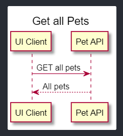

# PlantUML


If I'm honest, UML was never something I was interested in at University. Even back then, I understood the importance of UML when designing applications, but I think as a developer, I was more interested in building stuff. But in real life, we will soon run into problems if we do not have design diagrams when working in a multi-team environment. At best, we might miss some functionality. At worst, we will build the wrong thing. Design diagrams are also helpful in communicating with stakeholders who are not savvy with programming. They might not understand the terminologies used by the developers, but diagrams will help you describe the system to them.

These days I am using PlantUML to create diagrams when I am building services. I like how easy it is to create a diagram with PlantUML. Because diagrams created using PlantUML are text documents(PlantUML generates the diagram based on the text document) with the `.plantuml` file extension, I can also version control the changes over time. I think this is the most significant benefit of using PlantUML.

Here is an example of a sequence diagram created using Plantuml

```
@startuml
title Get all Pets
"UI Client" -> "Pet API": GET /pet
"Pet API" --> "UI Client": /pet Response
@enduml
```



VS Code has an extension([PlantUML extension](https://marketplace.visualstudio.com/items?itemName=jebbs.plantuml)) you can use to create the diagrams. If you don't use VS Code or if you don't want to install the extension, you can use the PlantUML online server([PlantUML Online Server](http://www.plantuml.com/plantuml/uml/SyfFKj2rKt3CoKnELR1Io4ZDoSa70000)) to create the diagrams.

During my research to write this blog post, I also found a web application called [PlantText](https://www.planttext.com/), which you can use to create diagrams using text. The below quote is from [PlantText's about page](https://blog.planttext.com/about/).

> PlantText is an online tool that quickly generates images from text. Primarily, it is used to create UML (Unified Modeling Language) diagrams. Unlike most tools, PlantText can build diagrams without the use of a mouse because it relies on a text-based language called PlantUML.

This post is a very basic and very high-level introduction to the PlantUML. If you are interested in PlantUML, please visit the [PlantUML](https://plantuml.com/) website for more information on creating and customising other types of diagrams.

## Resources

- [Open-source tool that uses simple textual descriptions to draw beautiful UML diagrams.](https://plantuml.com/)
- [PlantUML - Visual Studio Marketplace](https://marketplace.visualstudio.com/items?itemName=jebbs.plantuml)
- [PlantText UML Editor](https://www.planttext.com/)
- [PlantUML Viewer](https://chrome.google.com/webstore/detail/plantuml-viewer/legbfeljfbjgfifnkmpoajgpgejojooj)
